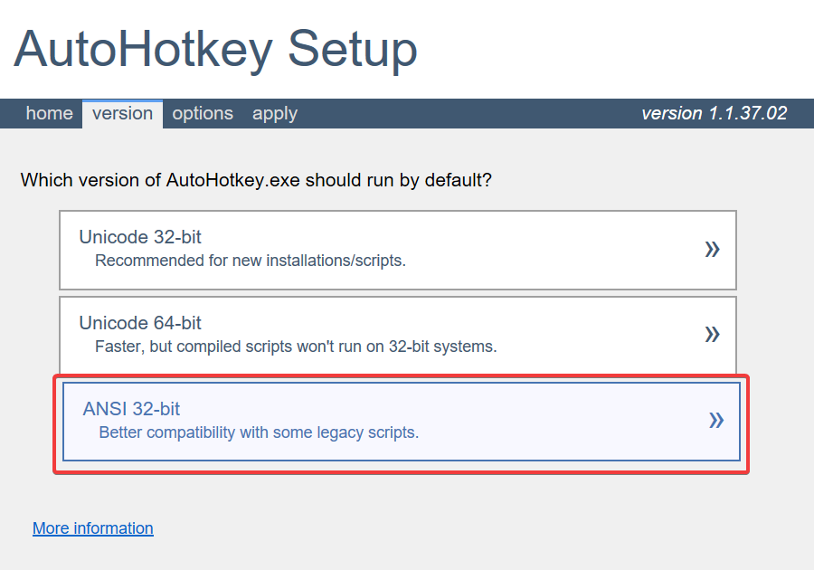

# Getting Started

This will show you how to set up AutoHotKey development environment and how to integrate the library
into your keybinder script.

:::info

**This library supports Windows and AutoHotKey v1.1 ANSI 32-bit only**. There's no guarantee that this works under Linux with any Windows emulator.

:::


## Installing AutoHotKey v1.1

You can download the latest AutoHotKey v1.1 [on their official homepage](https://www.autohotkey.com/). Make sure
to click on **Download v1.1 (deprecated)** as **this library does not support AHK > v1.1**.

Then, when running the installer, make sure to select **ANSI 32-bit**.



When the installer completes, you're pretty much good to go! When working on your scripts, make sure to use **Windows 1252** (or `Cp1252`) encoding. 
It's not guaranteed that the library works with Unicodes/UTF-8 encodings.

## IDE Setup

Some people tend to use [SciTE4AutoHotkey](https://github.com/fincs/SciTE4AutoHotkey) for AutoHotKey development.

I used Visual Studio Code with AHK++ plugin for development which works out quite well for me.
If you're interested in the same setup, you can take a look at `.vscode/` folder for recommended
extensions (though not every extension is needed for you).

In the end, pick whatever you're comfortable with. 😄

## Downloading 'SA:MP UDF for AutoHotkey v1.1'

### Latest Release

If you want to use the latest released version, you can download `SAMP.ahk` by going to this [GitHub Repository](https://github.com/thetruesorata/samp-udf-autohotkey) and selecting the latest release under section <em>"Release"</em> in the sidebar on the right-hand side.

### Latest Development

While we try to maintain working revisions of `SAMP.ahk` on `main` branch, it will contain bleeding edge that may not have been released yet. If you still want to opt for that version, you can simply download `SAMP.ahk` from the [`main` branch](https://github.com/thetruesorata/samp-udf-autohotkey/blob/main/SAMP.ahk).

## Creating Your First AHK Script

Create a new AHK file and make sure you place `SAMP.ahk` next to your AHK file.
Then, you can include `SAMP.ahk` by adding `#include %A_ScriptDir%\SAMP.ahk` at the top of your AHK file. A minimal working example may look like this:

```autohotkey
SendMode Input
SetWorkingDir %A_ScriptDir%
#Warn
#UseHook
#NoEnv
#SingleInstance force
#include %A_ScriptDir%\SAMP.ahk

Hotkey, Enter, Off
Hotkey, Escape, Off
return

; Make sure to toggle 'T' key (SA:MP chat window hotkey)
; so we don't trigger any of our keybindings accidentally
+T:: 
~t::
Suspend On
Hotkey, Enter, On
Hotkey, Escape, On
Hotkey, t, Off
return

~NumpadEnter::
~Enter::
Suspend Permit
Suspend Off
Hotkey, t, On
Hotkey, Enter, Off
Hotkey, Escape, Off
return

~Escape::
Suspend Permit
Suspend Off
Hotkey, t, On
Hotkey, Enter, Off
Hotkey, Escape, Off
return

Numpad1::
AddChatMessage("{FFFFF}Hello, World!")
return
```

You can also take a look at [`TestKeybinder.ahk`](https://github.com/thetruesorata/samp-udf-autohotkey/blob/main/TestKeybinder.ahk) which contains a more advanced implementation and usage of `SAMP.ahk`.